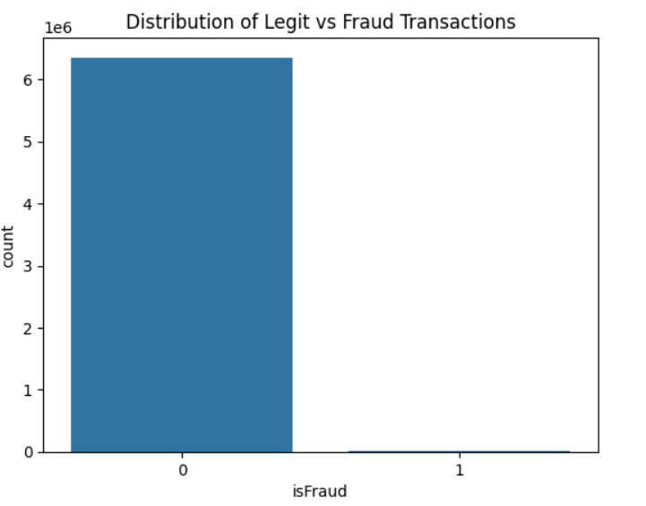
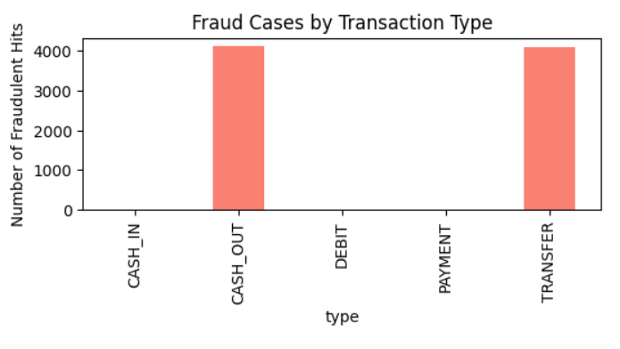
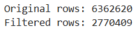
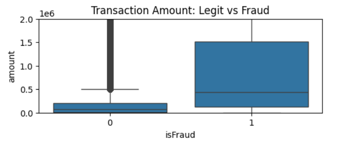
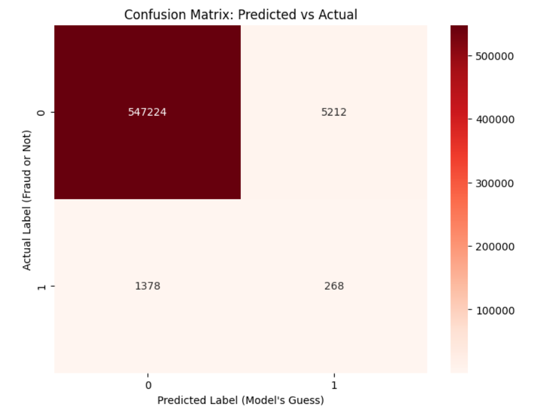

# 🛡️ Financial Fraud Detection System
### *An Unsupervised Anomaly Detection Approach using Isolation Forest*

## 📌 Executive Summary
Financial fraud poses a multi-billion dollar threat to the global banking sector. In this project, I developed a machine learning pipeline to detect fraudulent transactions within a dataset of **6.3 million financial records**. 

Unlike traditional classification projects that rely on labelled data, I implemented an **Unsupervised Anomaly Detection** strategy using the **Isolation Forest** algorithm. This mimics real-world scenarios where fraud patterns are unknown and constantly evolving.

---

## 🔍 Phase 1: Exploratory Data Analysis (EDA)
Before building the model, I conducted a deep-dive investigation into the dataset to understand the "fingerprints" of fraud.

### 1. The "Needle in a Haystack" Problem
The dataset is highly imbalanced. Fraudulent transactions represent **less than 0.1%** of the total volume. This confirmed that standard accuracy metrics would be misleading.

### 2. Identifying Risk Corridors
By analyzing fraud distribution across transaction types, I discovered a critical insight: **Fraud ONLY occurs in 'TRANSFER' and 'CASH_OUT' transactions.** 

* **Business Impact:** This insight allowed me to filter out **56% of the dataset** (PAYMENT, DEBIT, CASH_IN), significantly reducing computational costs and model noise without losing a single fraud case.

---

## 🛠️ Phase 2: Data Preprocessing & Pipeline
Based on EDA findings, I engineered a streamlined preprocessing pipeline:

1.  **Filtering:** Restricted data to `TRANSFER` and `CASH_OUT` types.
2.  **Feature Selection:** Dropped non-predictive columns (e.g., Customer Names) to prevent overfitting.
3.  **Encoding:** Converted categorical variables into numerical format.

*> Result: Reduced dataset from 6.3M rows to 2.7M relevant rows.*

---

## 🤖 Phase 3: Model Development (Isolation Forest)
I selected **Isolation Forest** for this task. 
* **Why?** Fraudulent transactions are "anomalies"—they are few in number and different in attribute values (e.g., emptying an account completely).
* **How it works:** The algorithm randomly splits data points. Anomalies are isolated much faster (fewer splits) than normal data points.

### Feature Analysis: Transaction Amounts
Boxplots revealed that fraudulent transactions often deviate from the standard transaction amount distribution, validating the use of an outlier detection algorithm.

---

## 📊 Phase 4: Performance Evaluation
Since this is an unsupervised model, "Accuracy" is not the primary metric. I focused on **Recall** (Catching the bad guys) and the **Confusion Matrix**.

### The Confusion Matrix

### detailed Metrics

### 💡 Key Findings
* **Anomaly Detection Capability:** The model successfully identified **268 high-risk fraud cases** purely based on their mathematical "weirdness," without being explicitly told what fraud looks like.
* **False Positives:** The model flagged ~5,000 legitimate transactions as suspicious. In a real-world setting, these would be sent to a "Manual Review" queue.
* **Trade-off:** As a prototype, the model prioritizes sensitivity. Future iterations would focus on tuning the `contamination` parameter to improve Precision (reducing false alarms).
